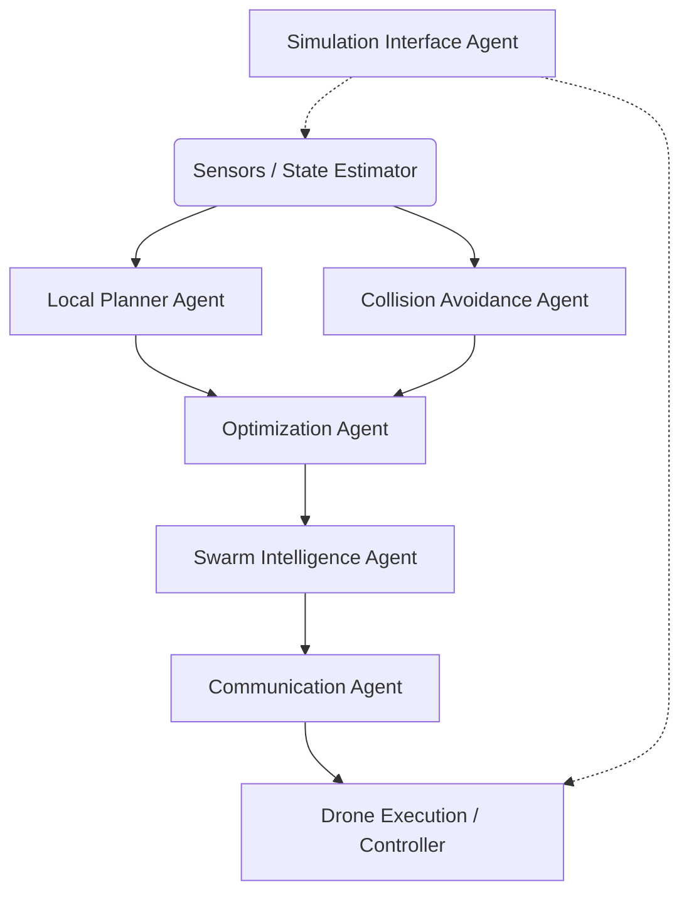

# Preliminary Design Review (PDR): AI-Agent-Driven  Swarm Navigation System

## 1. Project Overview
This document outlines the Preliminary Design Review (PDR) for a multi-agent autonomous quadrotor swarm system. The system utilizes Antigravity AI agents to orchestrate planning, coordination, and optimization leveraging the core concepts of the EGO-Planner (ESDF-free Gradient-based Optimization) framework.

By moving away from monolithic planning architectures to a distributed, agent-based intelligence model, the system achieves highly modular, adaptive, and ultra-low latency (<1 ms) decision-making. The traditional Euclidean Signed Distance Field (ESDF) dependency is completely replaced by a reactive, gradient-based optimization pipeline.

## 2. Core Operational Concept: AI-Agent Layer
The traditional pipeline (`Sensor ➔ Planner ➔ Controller`) is replaced with an AI-Augmented Pipeline:
**`Sensor ➔ AI Agents ➔ Optimized Decisions ➔ Controller`**

**Why AI Agents?**
*   **Modularity:** Distinct separation of concerns (trajectory vs. collision vs. coordination).
*   **Parallel Execution:** Lowers overall latency by optimizing sub-problems concurrently.
*   **Adaptive Decision-Making:** Intelligent handling of deadlock, dynamic environments, and inter-drone negotiations.
*   **Scalability:** Extremely easy to debug, isolate issues, and scale to dozens of drones.

## 3. System Architecture & Agent Responsibilities

### 3.1 Multi-Agent Architecture

### 3.2 Agent Definitions
1.  **Local Planner Agent:** Generates smooth initial trajectories using B-splines. Maintains control points and executes local replanning. (Based on `Φ(t) = Σ Q_i * B_{i,3}(t)`).
2.  **Collision Avoidance Agent:** Implements the ESDF-free logic. Detects intersections between the initial path and obstacles to generate anchor points ($p$) and repulsive vectors ($v$). Computes the gradient: `∇J = Σ (Q_i - p_i)v_i`.
3.  **Optimization Agent:** Executes numerical solvers (such as L-BFGS) to minimize the combined cost function comprising Smoothness, Collision, and Feasibility costs.
4.  **Swarm Intelligence Agent:** Handles high-level multi-drone coordination. Assures formation geometry, separation boundaries, alignment, and task allocation.
5.  **Communication Agent:** Manages inter-agent and inter-drone data transmission. Primarily designed around MAVLink but supports UDP/Custom protocols for low-latency state sharing.
6.  **Simulation Interface Agent:** Interfaces with ArduPilot/PX4 SITL and Gazebo. Handles state extraction, command injection, and physics time synchronization.

## 4. Key Algorithms & Mathematical Formulations

### 4.1 B-Spline Trajectory Representation
The system uses Uniform B-splines to guarantee trajectory continuity and smoothness. For a spline of degree $k$ (typically $k=3$ for jerk minimization), the control points $Q_i$ dictate the curve geometry. The Optimization Agent mutates these control points rather than sampling waypoints.

### 4.2 ESDF-Free Collision Avoidance Strategy
Traditional planners rebuild a heavy voxel grid and ESDF map. This architecture drops the ESDF update overhead.
*   **Process:**
    1. An A* specific algorithm generates a guiding, collision-free path segment ($\Gamma$) around an obstacle.
    2. Intersecting control points generate a penalty.
    3. An anchor point ($p$) is found on the obstacle surface, and an outward vector ($v$) pushes the trajectory out of the obstacle bounds.

### 4.3 Gradient-Based Optimization
The Optimization agent runs unconstrained optimization (e.g., L-BFGS). The objective function consists of:
`J_total = λ_smooth * J_smooth + λ_collision * J_collision + λ_feasibility * J_feasibility`

*   **J_smooth:** Penalizes high velocity, acceleration, and jerk.
*   **J_collision:** Pushes control points outside of the obstacle vector bounds.
*   **J_feasibility:** Soft constraints to ensure the quadrotor's physical limits (max velocity $v_{max}$, max acceleration $a_{max}$) are not exceeded.

### 4.4 Dynamic Feasibility & Time Scaling
If the Optimization Agent yields a trajectory whose derivatives violate physical bounds, the system triggers **time scaling**:
`Δt' = Δt * r_{max}`
This uniformly stretches the B-spline execution time, making the path physically feasible without altering its geometric shape.

## 5. Swarm Intelligence & Risk Mitigation

### 5.1 Decentralized + Cooperative Model
Each drone operates its own Local Planner and Optimization agents. The Swarm Agent shares minimal required state (Current Position, Projected Trajectory). The global system avoids single points of failure.

### 5.2 Failure & Risk Mitigation
| Risk Profile | Potential Impact | AI Agent Mitigation Strategy |
| :--- | :--- | :--- |
| **Agent Deadlock** | Two drones stuck yielding to each other | Swarm Agent enforces an ID-based priority list or leader election protocol. |
| **Comm. Delay/Packet Loss** | Swarm instability, collisions | Local Autonomy Fallback: predictive state estimation (dead-reckoning via B-splines) for neighboring drones. |
| **Local Minima** | Optimization gets "stuck" in a bad path | Multi-path planning agent seeds randomized exploration or multiple topological path variants. |

## 6. Development Phasing

*   **Phase 1: Core Agent Infrastructure & Single Drone (SITL):** Implement Local Planner, Optimization, and Simulation Agents. Validate single-drone B-spline generation.
*   **Phase 2: ESDF-Free Collision Pipeline:** Introduce the $p, v$ generator and the Collision Avoidance Agent. Connect to Gazebo simulated pointclouds/depth cameras.
*   **Phase 3: Swarm Expansion:** Boot multiple drones. Activate Communication and Swarm Agents. Tune inter-drone collision avoidance.
*   **Phase 4: Advanced Intelligence:** Introduce Learning-based tuning, predictive dynamic obstacle avoidance, and mission/task orchestrations.

---

## 7. Mandatory Implementation Skills & Guidelines

To successfully implement this architectural vision, the following skills and techniques are strictly required:

### Technical Stack & Libraries
1.  **C++ / C++17:** Required for real-time, low-latency (< 1ms) execution of the Optimization and Collision Agents.
2.  **ROS/ROS2 (Robot Operating System) / MAVROS:** For message passing, pointcloud handling, and TF (transform) node management.
3.  **MAVLink Protocol:** For direct drone communication and custom MAVLink message implementation (injecting B-Spline trajectories into the flight controller).
4.  **Eigen / Ceres Solver / NLopt:** Mathematical libraries for matrix operations and high-speed L-BFGS gradient optimization.
5.  **Python (PyBind11):** For ML/AI Swarm high-level decision-making orchestration and rapid simulation scripting.

### Algorithmic Skills
1.  **Kinodynamic Planning & B-Splines:** Deep mathematical understanding of uniform B-spline evaluation, local support properties, and derivative bounds.
2.  **Non-Linear Optimization (L-BFGS):** Crafting smooth, mathematically convex/pseudo-convex cost functions and analytically deriving their gradients.
3.  **Graph Search (A* / JPS):** For the initial topological pathfinding before the gradient optimizer takes over.
4.  **Pointcloud Processing:** Handling raw depth maps/pointclouds, raycasting, and fast geometric intersection checks.

### Best Practices & Guidelines
*   **Zero-Copy Memory:** Use shared memory pointers between the perception layers and planner layers where possible to minimize latency.
*   **Analytical Gradients Over Numerical:** Always derive and implement analytical gradients for the Optimization Agent to hit the < 1ms latency target.
*   **Hardware-In-The-Loop Readiness:** Design the Simulation Agent to exact real-world interfaces. The transition from SITL (Gazebo) to real drones should require *zero* algorithmic changes.
*   **State Machine Safety:** Implement rigorous fail-safes. If the optimizer diverges or fails, the drone must default to a safe-hover or localized braking trajectory immediately.
